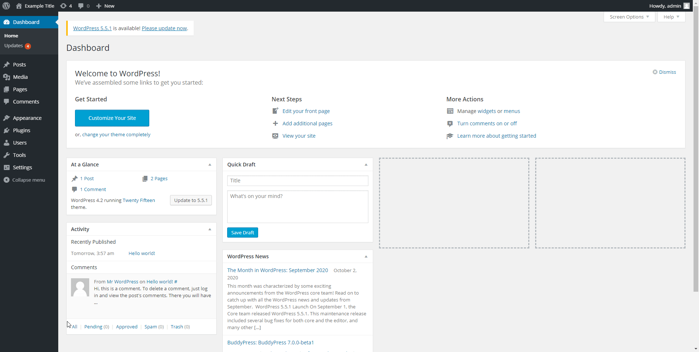

# Project 7 - WordPress Pentesting

Time spent: 3 hours spent in total

> Objective: Find, analyze, recreate, and document **five vulnerabilities** affecting an old version of WordPress

## Pentesting Report

### 1. CVE-2018-20714 Arbitrary File Deletion
  - [ ] Summary: Post thumbnail can be set to an arbitrary path, which is deleted when the post is deleted. Requires author account.
    - Vulnerability types: Aribtary file deletion
    - Tested in version: 4.2
    - Fixed in version: 4.9.7
  - [ ] GIF Walkthrough: 
  - [ ] Steps to recreate: 
     1. Upload a new media
     2. Note the media ID
     3. Go to http://wpdistillery.vm/wp-admin/post.php?post={mediaId}&action=edit and view the page source to get the post wpNonce
     4. Make the following post request to update the thumbnail with the path to the file you wish to delete.
     ```
     curl -v 'http://wpdistillery.vm/wp-admin/post.php?post=10' -H 'Cookie: {validSessionCookie}' -d 'action=editattachment&_wpnonce={wpNonce}&thumb={pathToFileToDelete}'
     ```
     5. Go back to the edit post page and find the delete post wpNonce value and note it down.
     6. Post the following URL with the delete post nonce.
     ```
     curl -v 'http://wpdistillery.vm/wp-admin/post.php?post=10' -H 'Cookie: {validSessionCookie}' -d 'action=delete&_wpnonce={deleteNonce}'
     ```
  - [ ] Affected source code:
    - [post.php](https://core.trac.wordpress.org/browser/tags/4.2/src/wp-includes/post.php?rev=32282)
### 2. Path Traversal in Unzipping
  - [ ] Summary: Malicious paths may be included in a compressed ZIP archive that is unpacked to the server as a result of using PHP built in ZipArchive library. This can result in files being unpacked to unintended directories as long as the web server has permission. Reference: https://hackerone.com/reports/205481
    - Vulnerability types: ZIP path traversal
    - Tested in version: 4.2
    - Fixed in version: 4.2.16
  - [ ] GIF Walkthrough: 
  - [ ] Steps to recreate: 
     1. Download POC ZIP file (created by Alex Chapman). Link: https://github.com/pydlv/wpvuln/blob/main/zip_poc.zip
     2. Go to install a plugin and upload the ZIP file.

